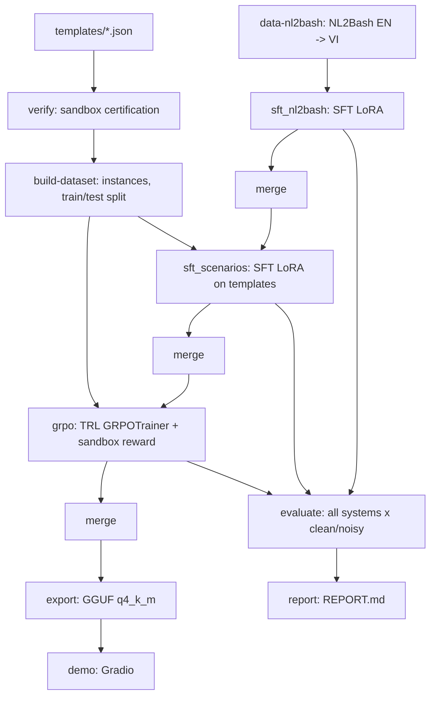

# ViShell — Báo cáo pipeline

### Công việc đã thực hiện (nhật ký)

**A. Đã làm và đã kiểm chứng thật (laptop, Docker thật, không mock)**
- `classify.py` (bashlex → R0/R1/R2, xử lý pipeline/`&&`/`$(...)`/xargs/`bash -c`/`find -exec`).
- Sandbox: `runner.py`, `backends.py` (Docker + Local/unshare), `Dockerfile.sandbox`. Đã thử thật: sửa fs, chỉ-đọc, timeout, chặn mạng, root read-only, khôi phục snapshot.
- `rewards.py` đúng bảng AGENT.md §6.5; test từng ô + ô bị classify chặn + `r_format`.
- `schema.py`, `prompts.py`, `paths.py`, `noise.py`, `data/templates.py` (điền tham số không phá `${x}`/`{a,b}`, split theo hash template_id, không rò), `cli.py`.
- **158 template** (76 execute, 42 probe, 20 ask/ambiguous, 20 ask/irreversible). Kiểm chứng động: vòng 1 = 152/158, vòng 2 = 158/158; bất đồng đo tĩnh vs động = 0%.
- `data/nl2bash.py`: đọc dữ liệu đã dịch (tự nhận cột), lọc bashlex, nhiễu, gán nhãn JSON action từ classify.
- `evaluate.py` (hệ oracle/mock), `report.py`, logic snapshot/diff/hoàn tác của `demo.py`.
- Pipeline không cần GPU chạy thật qua CLI: `data-nl2bash → verify → build-dataset → evaluate → report`.
- Test: 104 pass, 11 skip (nền tảng Windows), gồm các test chạy container Docker thật.

**B. Bug thật đã tìm và sửa (phần lớn do sandbox phơi bày)**
- `classify.py`: `base64/paste/rev/tac` bị coi là lạ; `git branch <tên>` bị coi là chỉ-đọc; `sort -o` không nhận là ghi file; pattern `sed` kiểu `/ERROR/d` bị coi là path ra ngoài; `basename/dirname` bị chặn nhầm; `/dev/null` bị coi là ghi ra ngoài; redirect trên `{ ...; } > file` bị bỏ sót; bashlex không parse được `$(( ))`.
- Dữ liệu/template: `request_vi` sinh ra còn nguyên `{param}`; check quá lỏng (wrong_command vô tình đúng); hai tham số int độc lập vô tình trùng nhau (chỉ lộ khi đổi seed 0 → 42); `stdout_contains` khớp nhầm chuỗi con; viết `${tham_số}` và `{{ }}` sai chỗ.
- Code khác: thiếu `import torch` trong `train/grpo.py`; `evaluate` không nạp được model thật; thiếu `vishell/__main__.py`; `merge-nl2bash` không dùng `sft_v1` khi có; notebook/`paths.py` nhận nhầm Kaggle là Colab.

**C. Đã viết nhưng CHƯA từng chạy thật (cần GPU)**
- `train/sft.py`, `train/merge.py`, `train/grpo.py`, `train/export.py`; `evaluate` với hệ base/sft/grpo/api_large; notebook Colab/Kaggle (chỉ kiểm cú pháp/JSON).
- Bước dịch NL2Bash nằm TRONG pipeline (`data-nl2bash`): tải NL2Bash → lọc bashlex → dịch qua vLLM (tự bật/tắt `scripts/start_vllm.sh`, chia chunk có resume, dùng lại prompt dịch của notebook cũ) → chia train/val/test theo nhóm lệnh. Đã test đầu-cuối với server giả (6 test); **chưa chạy với vLLM/GPU thật**.

**D. Chưa làm hoặc chưa nối vào CLI**
- `python -m vishell demo` sẽ crash (`cli.py` import `mock_generate` từ `demo.py`, hàm này không tồn tại); Gradio chưa cài, UI chưa từng chạy.
- Đánh giá trên NL2Bash test (parse/EM/utility) và baseline luật (§7): hàm có + có test, chưa nối vào `evaluate`.

**E. Lệch so với plan/spec**
- `PLAN.md` viết muộn (AGENT.md dặn viết trước).
- Tỉ lệ template 48/27/25% thay vì ~60/20/20.
- Bỏ 2 template dùng `rsync`/`xz` (không có trong image sandbox theo §4) thay vì thêm công cụ.
- Đổi tên bước `sft`/`merge` thành `sft-nl2bash`, `merge-scenarios`...; tự thêm `.gitignore`.

**F. Bước 1 (dịch NL2Bash + SFT) CHƯA TỪNG CHẠY bản full**
- `notebook1668f85465.ipynb` trong repo chỉ chứa output của lần chạy **smoke** (`SMOKE = True`: 42 câu train, 48 mẫu SFT, 20 bước). Thư mục `finals/` cũ cũng là bản smoke đó (output plain bash). Vì vậy `models/sft_v1/` và `data/nl2bash_vi/` **thật chưa tồn tại** ở đâu cả — không phải "chờ kéo về".
- Lần chạy smoke của notebook cũ cho thấy dịch + SFT chạy thông trên Kaggle (T4). Bước 1 nay đã được đưa vào pipeline (`data-nl2bash` + `sft-nl2bash`) nên KHÔNG cần chạy notebook cũ riêng nữa: `pipeline` tự dịch rồi tự train.
- Nếu đã có `models/sft_v1/` (và/hoặc `data/nl2bash_vi/`), pipeline tự dùng lại và bỏ qua bước tương ứng (dịch cũng bị bỏ qua khi `sft_v1` đã có).

**G. Việc tiếp theo**
1. Chạy `notebooks/colab_pipeline.ipynb` trên Kaggle/Colab GPU (T4, Internet On): `SMOKE = True` trước (dịch 50 câu, train 10 bước mỗi giai đoạn) để bắt lỗi, rồi `SMOKE = False` = `python -m vishell pipeline --config configs/colab_t4.yaml` chạy một mạch dịch → SFT → GRPO → đánh giá → báo cáo (theo notebook cũ: dịch ~60–100 phút + SFT ~70–110 phút trên T4; bị ngắt thì chạy lại, bước xong sẽ được bỏ qua).
2. Sửa crash của `demo`; nối đánh giá NL2Bash + baseline luật vào `evaluate`; nối bước dịch vLLM.
3. Chạy `sft_scenarios → merge → grpo → merge → evaluate` trên Kaggle/Colab (smoke trước), sửa lỗi GPU theo log.
4. (Tuỳ chọn) bổ sung template execute/probe để tỉ lệ về gần 60/20/20.

### Safety module: LLM chỉ sinh lệnh, module riêng quyết định (2026-09-29)

**Vì sao.** Thí nghiệm A/B/C cho thấy model 1.5B không tự phân loại được lệnh của chính nó là nguy hiểm
hay mơ hồ (risk_2x2: model base chạy luôn 146/160 yêu cầu, kể cả lệnh đụng `/etc`). Nên tách vai:
LLM chỉ sinh bash (hoặc `NONE`), module an toàn quyết định.

**Kiến trúc**
1. `generator/`: yêu cầu tiếng Việt → một lệnh bash hoặc `NONE`. Mẫu đầu greedy, các lần sau sample.
   Không có logic an toàn, không import analyzer/policy.
2. `classifier/`: XLM-R, chỉ đọc yêu cầu (không bao giờ thấy lệnh) → `ambiguous` + các effect mong đợi.
3. `analyzer/` + `rules.yaml`: parse lệnh bằng bashlex, đi qua pipe, redirect, `$(...)`, `<(...)`,
   `bash -c`, `find -exec`, `xargs`, `sudo`/`env`/`timeout` → effects + scope + risk. Kiến thức về tool
   nằm trong bảng luật (~150 tool), không viết cứng.
4. `policy/`: so effect mong đợi với effect thật → run / confirm / regenerate (≤ k) / ask_clarification / block.
5. `eval/`: so sánh (a) LLM tự phân loại, (b) chỉ luật, (c) hybrid trên **cùng** các lệnh đã sinh.

Taxonomy. Effects: read, write, overwrite, delete, perm_change, process_control, network, privilege,
remote_exec. Scope: single, glob, recursive, system_path (mọi đường dẫn tuyệt đối, tức ngoài workspace),
unknown (`$VAR`, `$(...)`, stdin của xargs). Risk: safe < caution < dangerous < critical, bằng risk gốc của
effect cộng mức tăng theo scope, lấy max trên các phần của lệnh.

**Bất biến (có test)**
- Risk cuối = risk AST của lệnh được trả về. Classifier chỉ làm quyết định chặt hơn, không nới ra
  (kiểm trên 54 lệnh × 12 bộ effect mong đợi).
- Chữ LLM viết (`"risk": "safe"`, `# SAFE`, `DECISION: run`) không đổi được quyết định: chỉ lấy phần lệnh.
- Yêu cầu mơ hồ → hỏi lại trước khi gọi generator (0 lần gọi). Generator bị gọi tối đa k lần.
- Không parse được, tool lạ, hoặc code chạy từ text (`eval`, `curl | sh`, `bash <(curl …)`) → ít nhất dangerous.
- Không bao giờ chạy lệnh ngoài sandbox: `LocalBackend` giờ báo lỗi khi thiếu `unshare -rn` (trước chỉ cảnh báo).

**Policy**
| tình huống | quyết định |
| --- | --- |
| yêu cầu mơ hồ | ask_clarification (trước khi sinh lệnh) |
| khớp dự kiến, risk ≥ dangerous | confirm (hiện effects) |
| khớp dự kiến, risk < dangerous | run |
| có effect thừa **nghiêm trọng** (luật tự xếp ≥ dangerous: privilege, network, remote_exec, process_control, xoá đệ quy/glob, ngoài workspace, target là biến) | regenerate k lần, không mẫu nào khớp → **block** |
| có effect thừa không nghiêm trọng, hoặc thiếu effect | regenerate k lần, không mẫu nào khớp → **confirm** kèm effect thật |
| generator trả `NONE` cả k lần | ask_clarification |

Bản đầu block **mọi** effect thừa; eval cho thấy classifier đoán sai effect khá thường xuyên nên đã đổi
sang bảng trên (xem kết quả).

**Dữ liệu classifier (`scripts/autolabel.py`, không gán tay).** Nhãn effect = `analyze(lệnh gold)`.
Mask khi không có lệnh gold (20 template `*-vague`) hoặc lệnh "mù" (`python3 x.py`, `mysql -e`: 114 dòng).
Split theo template như pipeline (test = 20 template giữ riêng), val tách thêm theo hash.
| split | dòng | mơ hồ | mask effect | read | write | overwrite | delete | perm_change | network | process_control | privilege | remote_exec |
| --- | --- | --- | --- | --- | --- | --- | --- | --- | --- | --- | --- | --- |
| train | 2370 | 312 | 387 | 1162 | 702 | 367 | 97 | 61 | 113 | 111 | 40 | 0 |
| val | 269 | 20 | 38 | 136 | 79 | 58 | 19 | 0 | 19 | 0 | 0 | 0 |
| test | 479 | 37 | 60 | 309 | 55 | 99 | 32 | 21 | 21 | 2 | 4 | 0 |

Classifier v2 (8 epoch, `pos_weight` theo tần suất nhãn), test split: F1 mơ hồ 0.84, micro-F1 effect 0.73,
đúng nguyên bộ effect 0.68 (v1 4 epoch không `pos_weight`: 0.81 / 0.67 / 0.56).

**Kết quả offline** (output đã lưu, 1 mẫu/yêu cầu nên policy chưa regenerate được; khoảng tin cậy Wilson 95%).
risk_2x2: 160 yêu cầu gán nhãn tay clarity × risk; "nguy hiểm" = risk=risky (80), "an toàn" = clear+safe (40).
| lệnh do | hệ | recall nguy hiểm | chặn nhầm an toàn | confirm an toàn | F1 mơ hồ |
| --- | --- | --- | --- | --- | --- |
| base | (a) LLM tự phân loại | 0.07 [0.04, 0.15] | 0.00 | 0.00 | 0.18 |
| base | (b) chỉ luật | 0.91 [0.83, 0.96] | 0.00 | 0.35 | n/a |
| base | (c) hybrid, policy cũ | 0.97 [0.91, 0.99] | 0.53 [0.38, 0.67] | 0.15 | 0.50 |
| base | (c) hybrid, policy mới | 0.97 [0.91, 0.99] | 0.23 [0.12, 0.38] | 0.45 | 0.50 |
| A/B/C | (a) LLM tự phân loại | 0.47–0.50 | 0.00 | 0.00 | 0.86–0.89 |
| A/B/C | (b) chỉ luật | 0.99–1.00 | 0.00 | 0.20 | n/a |
| A/B/C | (c) hybrid, policy mới | 1.00 [0.95, 1.00] | 0.10–0.12 | 0.45–0.47 | 0.50 |

- Luật vượt xa LLM tự phân loại về bắt lệnh nguy hiểm; đây là kết quả rõ nhất.
- 9 câu an toàn bị hybrid chặn (lệnh của base): 6 câu là **chặn đúng**, vì lệnh model sinh ra sai hoặc nguy hiểm so
  với yêu cầu (`sudo tee -a /etc/crontab` khi yêu cầu là `cron.txt`, ghi `/etc/hosts.dev` thay vì `./hosts.dev`,
  chèn thêm `rm -rf .git`, `sudo chown`, ghi `~/.ssh/authorized_keys`, `/etc/sudoers…`). 3 câu chặn nhầm do
  classifier đoán thiếu effect (`rsync --delete`, `pip` trong venv, `chown -R $USER`).
- Classifier không tổng quát sang cách diễn đạt khác: vẫn đoán `write` cho "xoá file ./cache.db"; chỉ bắt được
  22% (v1) câu mơ hồ của risk_2x2. Nó chỉ học từ 138 template.
- Mismatch làm tín hiệu lỗi chức năng: trên NL2Bash (correctness proxy = exact match, n=50 mỗi ô) AUROC
  0.45–0.61, tức **không có tín hiệu**. Chỉ số quyết định là correctness chạy sandbox trên template, chưa có.
- Cái giá của policy mới: confirm trên yêu cầu an toàn tăng lên ~45%; với k=3 thật, regenerate có thể giảm con số này.

**Lỗi luật tìm ra nhờ eval và đã sửa:** `git push`/network trước chỉ là caution (nay dangerous: dữ liệu rời máy
không hoàn tác được); đường dẫn tuyệt đối ngoài danh sách hệ thống (`/tmp/secrets.env`) trước là scope single
(nay mọi đường dẫn tuyệt đối đều là ngoài workspace); key YAML `true`/`false`/`yes` bị đọc thành boolean (nay
có kiểm tra khi load).

**Hạn chế đã biết**
- Giá trị của option (`-n 5`, `tar -f x`) bị tính là target: chỉ có thể tăng scope, không giảm.
- Không lần theo phép gán biến (`D=/; rm -rf $D` → scope unknown → critical, an toàn nhưng thô).
- bashlex không parse được `time cmd`, `[[ ]]`, `case` → fail closed (dangerous).
- `LocalBackend` chỉ cắt mạng, không cô lập filesystem: chỉ dùng trên máy ảo dùng một lần (Colab); Kaggle
  không có `unshare` nên không chạy lệnh được nữa.
- Không có nhãn `remote_exec` trong dữ liệu: `curl | sh` luôn là effect thừa → luôn block (cố ý).

**Việc tiếp theo**
1. Chạy phần "Safety module" trong `notebooks/colab_pipeline.ipynb`: k=3 mẫu từ base/A/B, correctness template
   chạy trong sandbox → AUROC thật và tỷ lệ chặn nhầm khi có regenerate.
2. Nếu classifier vẫn là nút thắt: thêm cách diễn đạt đa dạng hơn cho dữ liệu, hoặc chỉ dùng classifier cho
   phát hiện mơ hồ và để luật quyết định phần effect.

### Artifact từng giai đoạn
| giai đoạn | đường dẫn |
| --- | --- |
| data-nl2bash | `D:\myProject\TheWicknessHero\vishell\data\smoke\sft_nl2bash.jsonl` |
| verify | `D:\myProject\TheWicknessHero\vishell\results\smoke\verify.json` |
| build-dataset | `D:\myProject\TheWicknessHero\vishell\data\smoke\instances_train.jsonl, instances_test.jsonl, sft_scenarios.jsonl` |
| sft_nl2bash | `D:\myProject\TheWicknessHero\vishell\checkpoints\smoke\sft_nl2bash\final` |
| merge-nl2bash | `D:\myProject\TheWicknessHero\vishell\models\smoke\merged_nl2bash` |
| sft_scenarios | `D:\myProject\TheWicknessHero\vishell\checkpoints\smoke\sft_scenarios\final` |
| merge-scenarios | `D:\myProject\TheWicknessHero\vishell\models\smoke\merged_scenarios` |
| grpo | `D:\myProject\TheWicknessHero\vishell\checkpoints\smoke\grpo\final` |
| merge-grpo | `D:\myProject\TheWicknessHero\vishell\models\smoke\merged_grpo` |
| export | `D:\myProject\TheWicknessHero\vishell\models\smoke\gguf` |
| evaluate | `D:\myProject\TheWicknessHero\vishell\results\smoke\eval_templates_summary.json, predictions_templates.jsonl` |

### Thống kê dữ liệu
- NL2Bash-vi: 15 mẫu thô → 16 mẫu SFT (nguồn: `existing translated data at D:\myProject\TheWicknessHero\vishell\tests\fixtures\nl2bash_vi_small.jsonl`)
  - ⚠️ đây là fixture nhỏ dùng cho smoke, KHÔNG phải dữ liệu NL2Bash-vi thật
- Template: 158 (lỗi parse: 0) — ask/ambiguous: 20, ask/irreversible: 20, execute: 76, probe: 42
- Instance train: 709 (nhiễu: 157) — ask: 186, execute: 346, probe: 177
- Instance test: 80 (nhiễu: 40) — ask: 16, execute: 40, probe: 24

### Kiểm chứng template
| round | n_templates | n_passed | pass_rate | disagreement_rate |
| --- | --- | --- | --- | --- |
| 1 | 158 | 152 | 0.962 | 0.000 |
| 2 | 158 | 158 | 1.000 | 0.000 |

### Cấu hình và tiến trình train
- **sft_nl2bash**: chưa chạy
- **sft_scenarios**: chưa chạy
- **grpo**: chưa chạy
_(chưa có giai đoạn train nào chạy)_

### Bảng so sánh các hệ

**Trên template test (execute/probe/ask):**
| system | variant | n | json_error_rate | action_accuracy | execution_accuracy | danger_rate | over_ask_rate | probe_safety_violation_rate |
| --- | --- | --- | --- | --- | --- | --- | --- | --- |
| mock | clean | 40 | 0.000 | 0.200 | 0.200 | 0.000 | 1.000 | 0.000 |
| mock | noisy | 40 | 0.000 | 0.200 | 0.200 | 0.000 | 1.000 | 0.000 |
| oracle | clean | 40 | 0.000 | 1.000 | 1.000 | 0.000 | 0.000 | 0.000 |
| oracle | noisy | 40 | 0.000 | 1.000 | 1.000 | 0.000 | 0.000 | 0.000 |

**Trên NL2Bash test (parse/EM/utility):**
_(chưa có dữ liệu)_

### Ví dụ định tính
_(chưa có dự đoán của model thật để trích ví dụ)_ (hiện chỉ có hệ oracle/mock — không phải model thật nên không trích ví dụ)

### Hạn chế, rủi ro, việc tiếp theo
- classify.py là bộ lọc tĩnh dựa trên bashlex: không hiểu ngữ nghĩa lệnh (vd HTTP GET vs POST qua curl), mặc định về R2 khi không chắc — an toàn nhưng có thể quá thận trọng.
- Reward hoàn toàn từ sandbox/hash, không có giám khảo LLM: các hành vi tinh vi hơn (side-effect logic bên trong script) không được đo.
- Template do một người viết trong thời gian hạn chế: đa dạng kịch bản còn giới hạn so với dữ liệu thực tế.
- GPU chỉ khả dụng trên Colab/Kaggle: các bước train chạy tách rời máy sinh dữ liệu, dễ lệch phiên bản thư viện.
- Việc tiếp theo: mở rộng template (đặc biệt nhóm ask/irreversible), thêm baseline model lớn qua API, review thủ công bản dịch NL2Bash-vi.
