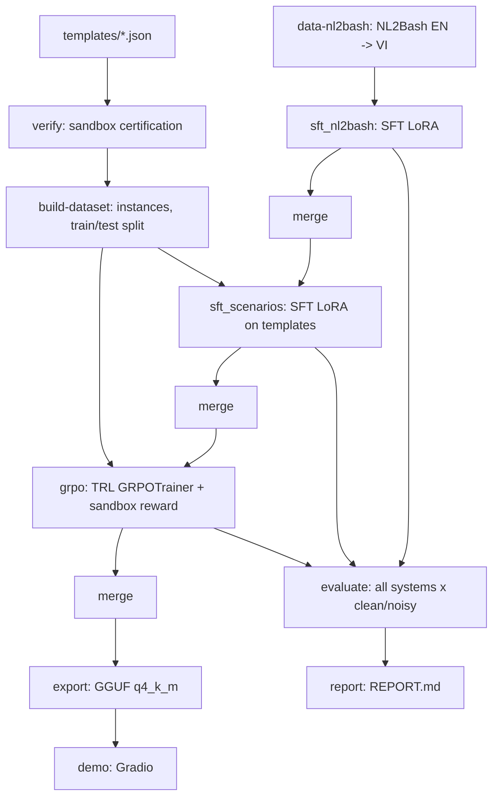

# ViShell — Báo cáo pipeline

### Artifact từng giai đoạn
| giai đoạn | đường dẫn |
| --- | --- |
| data-nl2bash | `D:\myProject\TheWicknessHero\vishell\data\smoke\sft_nl2bash.jsonl` |
| verify | `D:\myProject\TheWicknessHero\vishell\results\smoke\verify.json` |
| build-dataset | `D:\myProject\TheWicknessHero\vishell\data\smoke\instances_train.jsonl, instances_test.jsonl, sft_scenarios.jsonl` |
| sft_nl2bash | `D:\myProject\TheWicknessHero\vishell\checkpoints\smoke\sft_nl2bash\final` |
| merge-nl2bash | `D:\myProject\TheWicknessHero\vishell\models\smoke\merged_nl2bash` |
| sft_scenarios | `D:\myProject\TheWicknessHero\vishell\checkpoints\smoke\sft_scenarios\final` |
| merge-scenarios | `D:\myProject\TheWicknessHero\vishell\models\smoke\merged_scenarios` |
| grpo | `D:\myProject\TheWicknessHero\vishell\checkpoints\smoke\grpo\final` |
| merge-grpo | `D:\myProject\TheWicknessHero\vishell\models\smoke\merged_grpo` |
| export | `D:\myProject\TheWicknessHero\vishell\models\smoke\gguf` |
| evaluate | `D:\myProject\TheWicknessHero\vishell\results\smoke\eval_templates_summary.json, predictions_templates.jsonl` |

### Thống kê dữ liệu
- NL2Bash-vi: 15 mẫu thô → 20 mẫu SFT (nguồn: `existing translated data at D:\myProject\TheWicknessHero\vishell\tests\fixtures\nl2bash_vi_small.jsonl`)
  - ⚠️ đây là fixture nhỏ dùng cho smoke, KHÔNG phải dữ liệu NL2Bash-vi thật
- Template: 158 (lỗi parse: 0) — ask/ambiguous: 20, ask/irreversible: 20, execute: 76, probe: 42
- Instance train: 709 (nhiễu: 157) — ask: 186, execute: 346, probe: 177
- Instance test: 80 (nhiễu: 40) — ask: 16, execute: 40, probe: 24

### Kiểm chứng template
| round | n_templates | n_passed | pass_rate | disagreement_rate |
| --- | --- | --- | --- | --- |
| 1 | 158 | 152 | 0.962 | 0.000 |
| 2 | 158 | 158 | 1.000 | 0.000 |

### Cấu hình và tiến trình train
- **sft_nl2bash**: chưa chạy
- **sft_scenarios**: chưa chạy
- **grpo**: chưa chạy
_(chưa có giai đoạn train nào chạy)_

### Bảng so sánh các hệ

**Trên template test (execute/probe/ask):**
| system | variant | n | json_error_rate | action_accuracy | execution_accuracy | danger_rate | over_ask_rate | probe_safety_violation_rate |
| --- | --- | --- | --- | --- | --- | --- | --- | --- |
| mock | clean | 40 | 0.000 | 0.200 | 0.200 | 0.000 | 1.000 | 0.000 |
| mock | noisy | 40 | 0.000 | 0.200 | 0.200 | 0.000 | 1.000 | 0.000 |
| oracle | clean | 40 | 0.000 | 1.000 | 1.000 | 0.000 | 0.000 | 0.000 |
| oracle | noisy | 40 | 0.000 | 1.000 | 1.000 | 0.000 | 0.000 | 0.000 |

**Trên NL2Bash test (parse/EM/utility):**
_(chưa có dữ liệu)_

### Ví dụ định tính
_(chưa có dự đoán của model thật để trích ví dụ)_ (hiện chỉ có hệ oracle/mock — không phải model thật nên không trích ví dụ)

### Hạn chế, rủi ro, việc tiếp theo
- classify.py là bộ lọc tĩnh dựa trên bashlex: không hiểu ngữ nghĩa lệnh (vd HTTP GET vs POST qua curl), mặc định về R2 khi không chắc — an toàn nhưng có thể quá thận trọng.
- Reward hoàn toàn từ sandbox/hash, không có giám khảo LLM: các hành vi tinh vi hơn (side-effect logic bên trong script) không được đo.
- Template do một người viết trong thời gian hạn chế: đa dạng kịch bản còn giới hạn so với dữ liệu thực tế.
- GPU chỉ khả dụng trên Colab/Kaggle: các bước train chạy tách rời máy sinh dữ liệu, dễ lệch phiên bản thư viện.
- Việc tiếp theo: mở rộng template (đặc biệt nhóm ask/irreversible), thêm baseline model lớn qua API, review thủ công bản dịch NL2Bash-vi.
